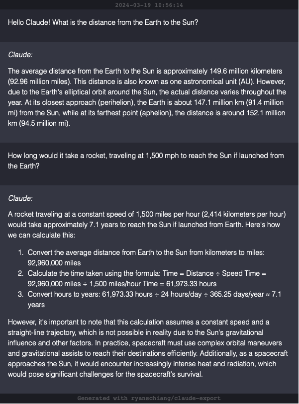

# Export Anthropic Claude Conversations

Format and download Anthropic Claude conversations to markdown, JSON, and PNG for sharing and exporting chat logs.

Exports the active Claude chat log directly from the browser console.

## Usage

 1. Navigate to [claude.ai](https://claude.ai).
 2. Open the chat thread you'd like to export.
 3. Open the browser console (how to open console: [Chrome](https://developer.chrome.com/docs/devtools/open), [Firefox](https://firefox-source-docs.mozilla.org/devtools-user/), [Safari](https://developer.apple.com/library/archive/documentation/NetworkingInternetWeb/Conceptual/Web_Inspector_Tutorial/EnableWebInspector/EnableWebInspector.html))
 4. Follow the below steps depending on which output type you'd like.

### JSON

1. Copy contents of [`/dist/json.min.js`](./dist/json.min.js)
2. Paste into browser console

### Markdown

1. Copy contents of [`/dist/md.min.js`](./dist/md.min.js)
2. Paste into browser console

### Image (.PNG)

1. Copy contents of [`/dist/image.min.js`](./dist/image.min.js)
2. Paste into browser console

#### Example output (Image Export):

## Limitations

This is a trivial implementation as Claude currently does not support sharing or exporting conversations. It may break with future changes.

It currently supports:
- Paragraphs / Text
- Lists
- Code blocks
- Tables

## You May Also Like

[`chatgpt-export`](https://github.com/ryanschiang/chatgpt-export) - Export OpenAI ChatGPT conversations to markdown, JSON, and PNG for sharing and exporting chat logs.

## Future Work

[ ] Nested code blocks (within lists)
[ ] Trim whitespace on exported images
[ ] Fix syntax highlighting